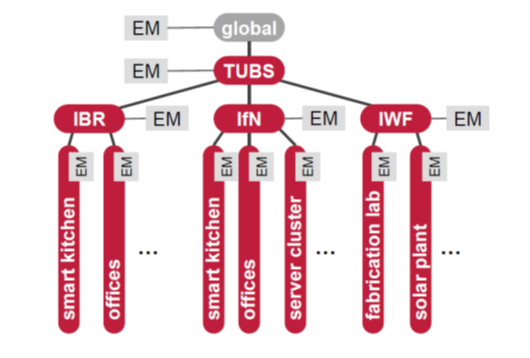

## osiota: Building networks

osiota is a software platform to exchange data. Measurement data as well as control actions for actors can be exchanged. It is based on Node.js (a JavaScript framework).

The core concept behind this project is to build networks of osiota instances, so called **coordinating nodes** (CN). These networks can span small areas or even a multitude of buildings. A coordinating node is the smallest autonomous unit in these networks. Often these networks are structured in a hierarchical order.

An example for such a structure can be seen in the diagram above. Every red block represents one osiota instance; the gray blocks an energy management application (EM) running on the instance.

  * On the base layer, you can see for example a smart kitchen or different offices. Here, the osiota software may run on a small computer e.g. a Raspberry Pi and communicate with different sensors and actuators deployed in these rooms. The collected data can be shared with other osiota processes. An osiota process can as well receive and react to other data in the network. One example for this behavior is to react to a high load situation in the local power grid by switching off non-essential devices to save power.
  * The coordinating node of the middle level (IBR, IfN, and IWF) collect and further process the data of one institute each. One of their objectives is to address possible privacy concerns. To do so, they are able to anonymize and bundle data. This ensures that no one on the outside (at higher layers) can access the data of specific offices or employees.
  * Above the institute coordinating nodes there is one additional level of hierarchy (TU-BS). Here all of the data-streams are tied together, aggregated and analyzed.

The objectives for this whole system are to aid in the general reduction of energy consumption, by exposing potentially unknown sources of big consumption and better organize the energy consumption. For example, peak loads can be spread out over time and self-produced, renewable energy can be used more effectively. Strategies and algorithms which help to achieve these objectives can be deployed on all levels of the hierarchy.

For configuration samples see [here](building_networks_samples/).