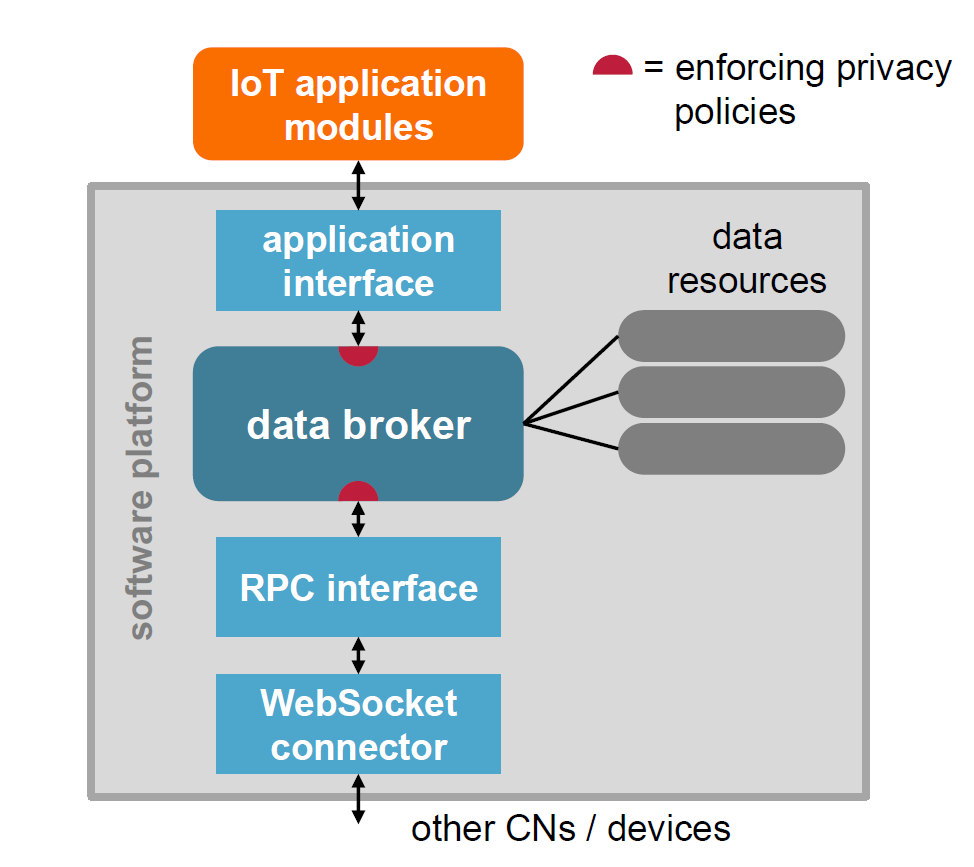

## Composition of osiota

The structure of osiota and how private data is protected can be seen in the following figure:

osiota consists of a central core – a data broker and software platform – which starts **apps** for further functionality. The apps implement additions to the functionality of osiota, those additions are e.g. hardware bindings to sensors and actuators or data processing algorithms. osiota handles the communication with other osiota processes over WebSocket connections.

osiota handles data in so called **nodes**. Those nodes can be generated at startup or during the runtime and each represent one data-stream enhanced by meta-data. For example one node could be the energy-consumption of a fridge, then they carried data would be the current energy usage and the meta-data could contain information about the unit of the energy consumption or further specifications of the fridge. Often energy-consumption is measured once a second, in this case osiota would publish the measurement every second to the corresponding node. Other apps who are interested in the data of the fridge can subscribe to the node and will be informed about every new published value.
